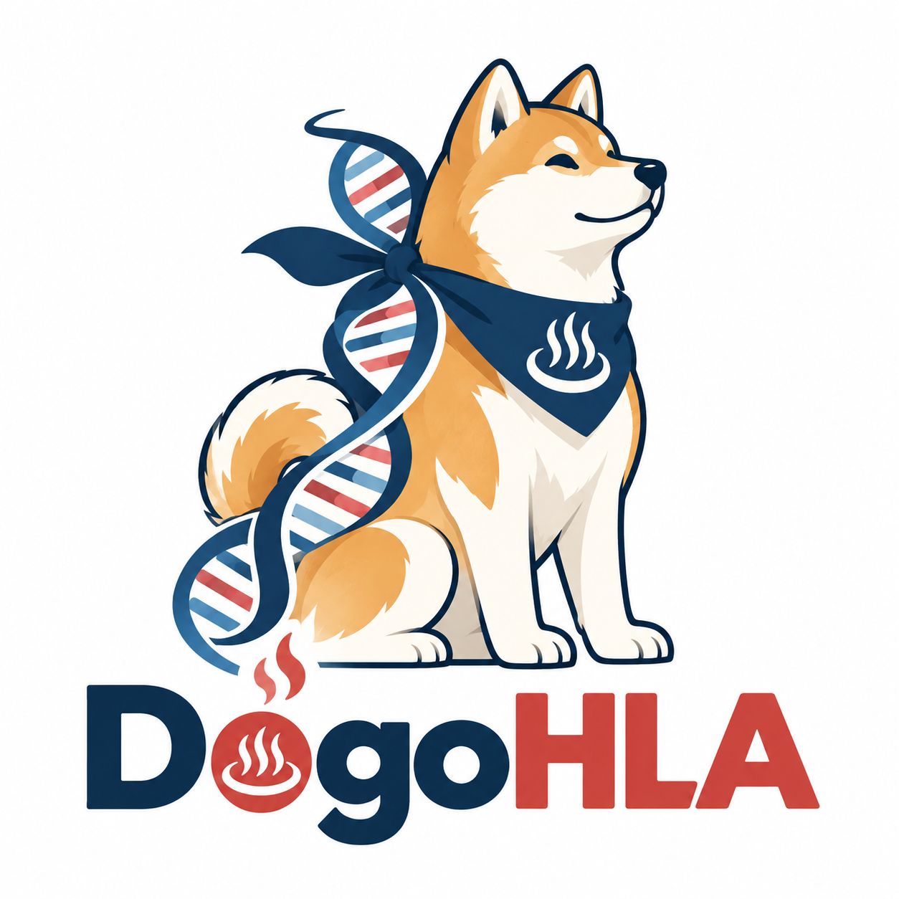

<p align="center"></p>

# DōgoHLA and AsianPGR

**DōgoHLA** is a population-specific, pangenome-based method for reconstructing
HLA gene sequences from short reads. **AsianPGR** is the Asian- and Arab-enriched
MHC pangenome reference built during DBCLS BioHackathon Japan 2026.

This repository is the public release home for the method, graph and manuscript.

- [Release v0.1.0](https://github.com/biohackathon-japan/BH26-asian-hla/releases/tag/v0.1.0)
- [DōgoHLA source and run instructions](workflow/hla-spechla-pg/README.md)
- [AsianPGR graph contents and mapping example](asianpgr/README.md)
- [Manuscript](paper/paper.md) and [PDF](paper/paper.pdf)
- [Release contents and verification](releases/v0.1.0.md)

## Release contents

| Asset | Contents |
| --- | --- |
| `DogoHLA-v0.1.0-source.tar.gz` | Method source, regression tests, development evidence and preparation scripts |
| [AsianPGR graph archive](https://bio2vec.net/data/asianpgr/v0.1.0/AsianPGR-v0.1.0.tar.gz) | Full and clipped MHC GBZ graphs, short-read Giraffe indexes, VCF, contig mapping and build provenance |
| [Frozen analysis archive](https://bio2vec.net/data/asianpgr/v0.1.0/BH26-HLA-v0.1.0-analysis.tar.gz) | Frozen analysis code, compact result tables and source manifests in their original directory layout |
| [SHA256SUMS](https://bio2vec.net/data/asianpgr/v0.1.0/SHA256SUMS) | Checksums of the three release archives |

Large release files are hosted at <https://bio2vec.net/data/asianpgr/v0.1.0/>, alongside the JaSaPaGe data
on bio2vec.net. GitHub hosts the versioned release page, code and source archive.

The source release preserves the implementation used for the reported experiments.
Inference currently requires the documented prepared reference layout and software
environment. See the method instructions for dependencies, preparation and output
contracts. External allele databases and raw sequencing reads are obtained from
their original providers.

## Check the source

From a checkout or the extracted DōgoHLA source archive:

```sh
python3 scripts/fetch_nomenclature.py
python3 -m unittest discover -s workflow/hla-spechla-pg -p 'test_*.py' -v
python3 workflow/hla-spechla-pg/dogohla.py --version
```

The test suite uses NumPy, SciPy, pysam, edlib and Biopython. The fetch command
retrieves pinned IPD-IMGT/HLA v3.65.0 nomenclature directly from its provider.
Inference also uses SpecHLA v1.0.12 components, vg v1.76.1 and their command-line
dependencies. Dependency attribution is in [THIRD_PARTY.md](THIRD_PARTY.md).

## Results and scope

The eight-donor DōgoHLA development comparison recovered 57/128 exact whole-gene
haplotypes versus 36/128 with native SpecHLA, with 22.8% lower global edit distance.
These are selected development results. The frozen 32-donor prospective evaluation
was ongoing at the manuscript cutoff. AsianPGR includes 754 input haplotype entries;
held-out evaluations exclude test families from their inference references.

For scientific use, cite the manuscript and the underlying methods and pangenome
projects listed in its bibliography and the graph provenance. Authorship metadata
for the manuscript is being completed. Original repository material retains the
existing [CC0 dedication](LICENSE); third-party code and source datasets retain
their own terms as described in [THIRD_PARTY.md](THIRD_PARTY.md).
