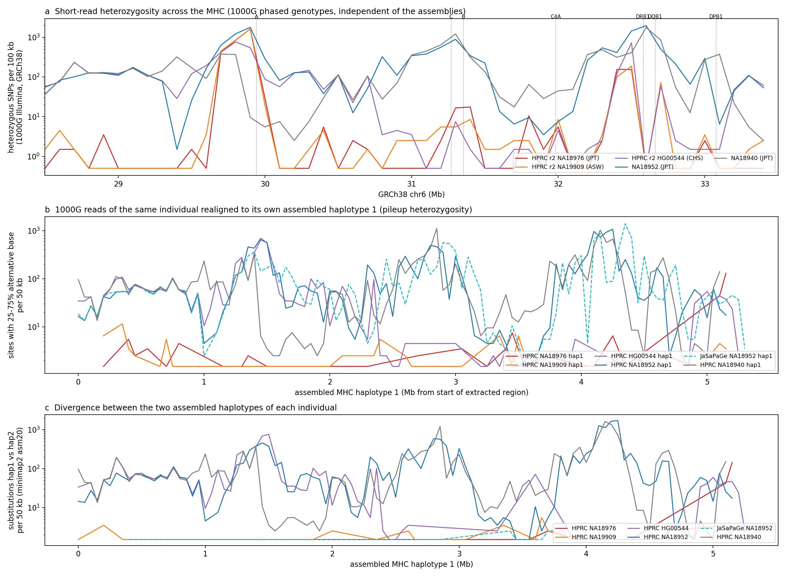
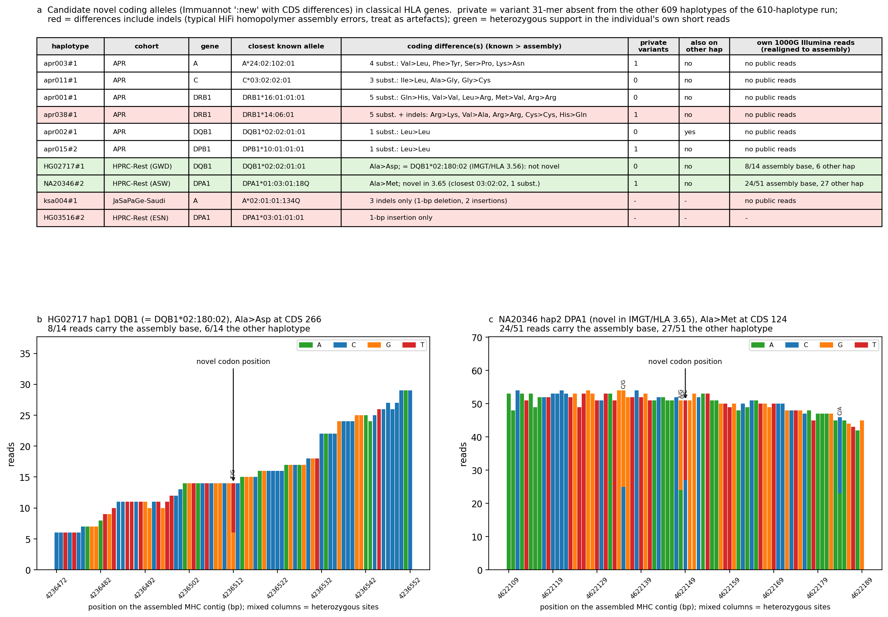
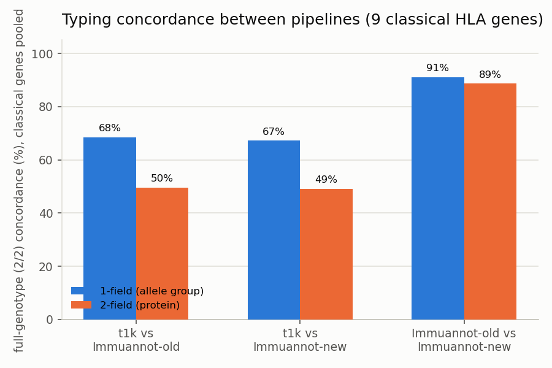
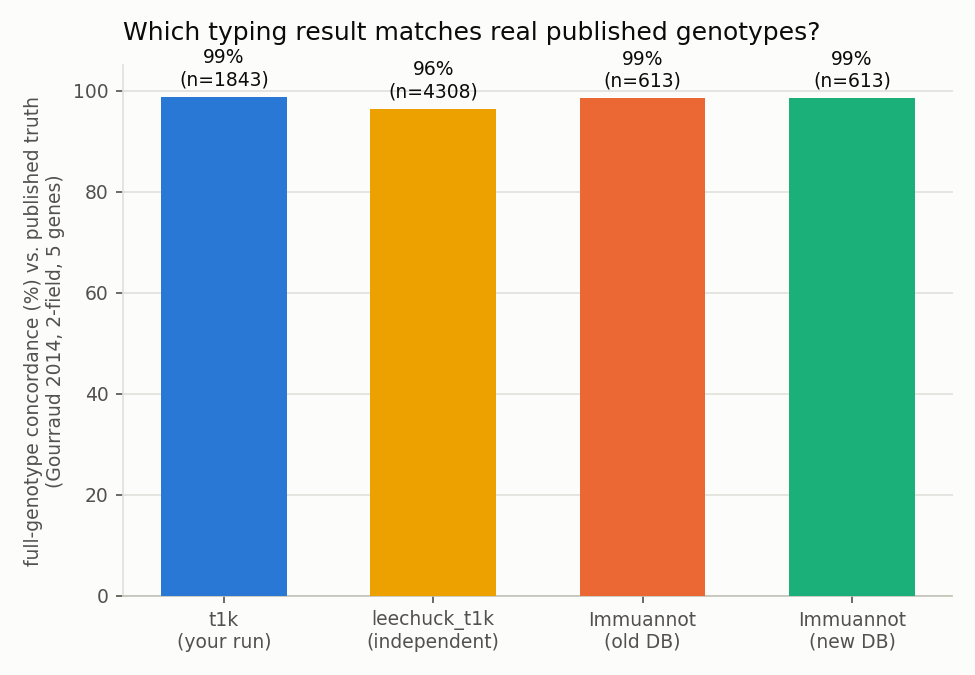
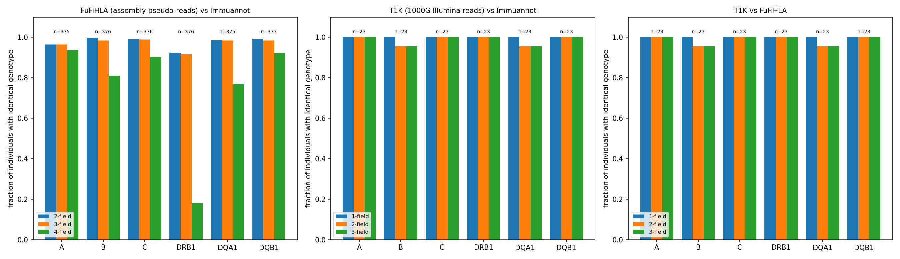

# Introduction

The HLA/MHC region on chromosome 6 is the most polymorphic part of the human genome and the
single most important genomic determinant of transplant compatibility, drug hypersensitivity and
autoimmune and infectious-disease risk. Existing HLA genotyping tools — HLA\*LA
[@Dilthey2019HLALA], T1K [@Song2023T1K], SpecHLA [@DeepOmicsSpecHLA] and others — were developed
and tuned mostly against reference panels (GRCh38, CHM13, HPRC) that are enriched for European,
African and admixed American ancestries. Middle Eastern and East/Southeast Asian populations are
comparatively under-represented, even though HLA allele and haplotype frequencies are strongly
population-specific. A recent deep long-read study of the non-classical class I genes in 531
Japanese individuals [@ItoNaito2026] names this under-representation explicitly as an open problem
in the field.

At BioHackathon Japan 2026 our goal was to build an HLA genotyping method specifically informed by
an Asian- and Arab-enriched pangenome — in spirit close to SpecHLA's approach of typing against a
personalized/graph-derived reference rather than a single linear one, but built on our own
pangenome graph rather than SpecHLA's. Over the course of the week we (1) assembled and extended an
Asian- and Arab-enriched HLA haplotype panel to 754 haplotypes; (2) built a whole-MHC
Minigraph-Cactus pangenome graph from it; (3) tested a first, direct way of using that graph for
genotyping — align, call variants, phase, take a consensus, then annotate — against an established
direct-read typer (T1K) and real experimental truth, to learn where a naive graph-based approach
helps and where it does not; and (4) used what we learned to start building the actual typer: a
PanGenie-based genotyper that calls graph bubbles directly from short reads without going through an
explicit consensus step, evaluated so far on an initial cohort of East and South Asian 1000 Genomes
donors. Parts of this are complete and validated; the typer itself is still in progress, and we
report its status honestly alongside the completed pieces below.

# Methods

## An Asian- and Arab-enriched HLA haplotype panel (754 haplotypes)

We extended our original 610-haplotype panel (APR 106, HPRC r2 464, JaSaPaGe Saudi 18 + Japanese 20,
GRCh38, CHM13) with 144 more haplotypes contributed by two additional pangenome projects whose raw
assemblies are not yet public: K-PanRef, a Korean pangenome (28 haplotypes, 14 individuals)
[@Shin2026KPanRef], and CPC, the Chinese Pangenome Consortium Phase 1 resource (116 haplotypes, 58
individuals) [@Wang2026CPC]. Because neither project has released per-sample assembly FASTAs, their
MHC sequences were instead pulled directly out of *their own* published Minigraph-Cactus graphs: for
K-PanRef, every haplotype path was extracted from the GBZ with `vg paths -F`; for CPC, the CHM13
chr6:28–34 Mb reference nodes were extracted with `odgi`, and the span of every CPC haplotype walk
through those nodes was read from the GFA. In both cases, extracted segments were kept only if they
had a minimap2 asm20 alignment of at least 50 kb of matching bases and MAPQ ≥ 20 against the GRCh38
MHC. Three CPC samples that are also HPRC individuals were not added twice. This gives 754
haplotype entries in total (Table \ref{tableCohorts}); after removing the two single-haplotype
references and five duplicate donor-assembly pairs (see below), 742 haplotypes from 371
name-reconciled donors remain for donor-level analyses. **Caveat:** K-PanRef and CPC haplotypes are
graph paths, not original assemblies — Minigraph-Cactus clips sequence unaligned to the graph
backbone, so haplotype-private insertions in these two cohorts can be shortened relative to the true
assembly.

HPRC r2 was additionally split into four population strata using 1000 Genomes/HPRC release 2 sample
metadata: HPRC-Japanese (JPT, 32 haplotypes), HPRC-Jewish (HG002 only, Ashkenazi, 2 haplotypes — a
single individual, not a population estimate), HPRC-EastAsian (CHB/CHS/CDX/KHV and HG005, 70
haplotypes) and HPRC-Rest (360 haplotypes).

Table: Haplotypes analysed, by cohort/stratum. \label{tableCohorts}

| Cohort / stratum | Haplotypes | Population | Source |
| --- | ---: | --- | --- |
| APR | 106 | Arab (UAE) | Assembly |
| HPRC r2 – Japanese | 32 | Japanese (1000G JPT) | Assembly |
| HPRC r2 – Jewish | 2 | Ashkenazi (HG002 only) | Assembly |
| HPRC r2 – East Asian | 70 | CHB/CHS/CDX/KHV, HG005 | Assembly |
| HPRC r2 – Rest | 360 | Mixed | Assembly |
| JaSaPaGe – Saudi | 18 | Arab (Saudi) | Assembly |
| JaSaPaGe – Japanese | 20 | Japanese (1000G JPT) | Assembly |
| K-PanRef | 28 | Korean | Graph path |
| CPC | 116 | Chinese | Graph path |
| GRCh38 / CHM13 | 2 | Reference | Reference |
| **Total** | **754** | | |

## Extraction and Immuannot annotation (unchanged core workflow)

The rest of the original CWL workflow (`hla_pangenome.cwl`) runs unchanged on the enlarged panel:
per haplotype, pgr-tk `pgr-query` [@Chin2023pgrtk] extracts the extended MHC region (GRCh38
chr6:28,510,120–33,480,577 ± 100 kb), and Immuannot v3 (IPD-IMGT/HLA 3.55, IPD-KIR 2.13, RefSeq C4)
[@Zhou2024Immuannot] calls gene structure and allele identity. All 754 haplotypes were
re-aggregated, per-gene sequences re-cut, and pgr-tk bundle decompositions and pggb
[@Garrison2024pggb]/odgi [@Guarracino2022odgi] graphs rebuilt.

## Whole-MHC Minigraph-Cactus pangenome graph

We built a single whole-MHC pangenome graph from all 754 haplotypes with `cactus-pangenome`
(Cactus 3.3.0 static release; Minigraph-Cactus algorithm [@Hickey2024MinigraphCactus]), referenced
against both GRCh38 and CHM13, with `--gfa clip full --gbz clip full --giraffe clip --vcf --odgi
full --viz`. The build ran on the NIG supercomputer (32 cores, 240 GB) in 3 h 43 min and produced a
graph of 417,896 nodes and 579,137 edges (5.89 Mb of sequence), with vg Giraffe indexes for short-read
alignment [@Siren2021Giraffe].

**Graph validation.** We mapped one 1000 Genomes individual's (HG00096) MHC-region read pairs to the
graph with `vg giraffe`: 654,059 of 657,052 pairs aligned (99.5%), 625,590 at MAPQ ≥ 20 (95.2%), in
26 s on 8 threads. This establishes that the graph is mappable to at high rates; it does not by
itself establish that alignment to the graph improves genotyping, which we tested directly next.

## Does graph-based genotyping beat a direct-read typer? A first, consensus-based attempt

As a first test of whether the new graph helps HLA typing at all, we built a pipeline that aligns
1000 Genomes short reads to the graph with `vg giraffe`, calls variants with `vg call`, phases them
with read-backed WhatsHap [@Patterson2015WhatsHap], takes a `bcftools consensus` hap1/hap2 FASTA per
sample, and re-annotates that consensus with Immuannot — i.e., the graph is used to build a
personal, phased pseudo-assembly, which is then typed exactly as the assembly panel above is typed.
We compared this against T1K [@Song2023T1K], which types directly from the same raw reads without
any graph or consensus step, and against real experimental truth (Gourraud et al. 2014's Sanger/SSO
HLA typing of 1000 Genomes samples, 955 of which overlap this cohort [@Gourraud2014]). We ran two
independent T1K invocations on the same reads as a check on typer-level noise, and re-annotated the
same consensus sequences against both the original frozen IPD-IMGT/HLA 3.55.0 and a freshly built
3.65.0 (the release T1K uses) to separate database-version effects from consensus-quality effects.
Concordance was scored at 1-field (allele group) and 2-field (protein) resolution on unordered
genotype pairs, on the 9 classical HLA genes (A/B/C/DRA/DRB1/DQA1/DQB1/DPA1/DPB1); Immuannot's
`:new` suffix (no exact database match) was stripped before truncation rather than treated as a
literal field, and a genotype comparison was skipped rather than counted as a mismatch when fewer
than 2 real fields remained on either side.

## RCCX/C4 structural genotyping prototypes (exploratory, not the main typer)

In parallel, we prototyped two lightweight, held-out-validated approaches to genotype the RCCX
module (which carries the C4A/C4B copy-number and long/short structural variation) directly from
short reads without full HLA allele calling: a k-mer/marker-counting method matched against graph
paths (`hla-structural/`, 106 donors: 18 pilot + 88 held out), and a dedicated 299-probe targeted
dosage assay (`hla-targeted/`, benchmarked against the published tool C4Investigator
[@Marin2024C4Investigator] on 24 held-out donors, with C4Investigator's own output calibrated on 18
pilot donors before blind application to keep the comparison fair). Both used donor-level,
family-disjoint held-out splits.

## Classical 11-locus typing benchmark on the full panel

To check that the enlarged panel and pipeline still produce reliable classical HLA calls, we
compared Immuannot's exact-CDS two-field calls at 11 classical loci (A/B/C/DPA1/DPB1/DQA1/DQB1/
DRB1/DRB3/DRB4/DRB5) on all eligible haplotypes of the 754-haplotype panel against the Gourraud et
al. 2014 experimental Sanger/SSO truth at the 5 genes it covers (A/B/C/DRB1/DQB1), retaining
published typing ambiguity and requiring two eligible current-CDS labels per donor.

## The typer in progress: PanGenie genotyping directly against graph bubbles

The consensus-based pipeline above showed that going through an explicit per-sample consensus loses
genotyping resolution (see Results). We are therefore building the actual typer around a different
strategy, closer to how PanGenie [@Ebler2022PanGenie] and SpecHLA's personalized-reference approach
avoid an explicit global consensus: genotype the graph's bubbles directly from k-mers in the raw
short reads, per sample, without ever constructing a linear consensus sequence to re-annotate.
Concretely: (1) `vg deconstruct` decomposes the whole-MHC graph into top-level bubbles relative to
the GRCh38 path, giving a bubble-level VCF; (2) for 5 donor-disjoint, family-disjoint,
population-balanced folds, we build two reference panels per fold — a "full" panel (all cohorts) and
an "HPRC-only" panel — so that adding the Asian-specific haplotypes (APR, JaSaPaGe, K-PanRef, CPC)
can be evaluated against an HPRC-only baseline under the same held-out design used for the RCCX/C4
prototypes above; (3) PanGenie genotypes each held-out donor's short reads against both panels for
its fold. The initial evaluation cohort is 40 1000 Genomes donors (20 East Asian, 20 South Asian),
selected to be family-disjoint and population-balanced, with Arabian donors reserved for a later
addition pending data availability. The same 40 donors' reads were also run through T1K and SpecHLA
for comparison, following the design in our study plan (`hla-study-plan/plan.tex`), which further
specifies HLA\*LA and a long-read SpecImmune/HLAminer arm as later additions.

**Status at the time of writing:** panel construction (bubble VCF, 5-fold full/HPRC-only panels)
and call generation are complete — all 120 jobs (40 donors × {T1K, SpecHLA, PanGenie-full,
PanGenie-HPRC-only}) finished successfully with verified output integrity. Accuracy scoring against
truth has not finished; we report the one completed sub-analysis (structural signature
representation) below and describe the rest as ongoing work.

# Results

## The MHC still comes out complete after tripling the panel's non-HPRC diversity

747 of 752 non-reference haplotypes reach ≥ 0.99 MHC coverage, and 720 of 752 land on a single
segment (Figure \ref{figExtraction}). The lower-coverage tail is concentrated in the two
graph-derived cohorts, as expected from upstream clipping: 4 CPC haplotypes (lowest 0.92) and 1
JaSaPaGe-Saudi haplotype (0.96); all directly-assembled cohorts (APR, HPRC, JaSaPaGe-Japanese,
K-PanRef) are at or near 1.00.


## Allele frequencies now separate nine strata, and the Korean/Chinese additions bring their own signal

Immuannot calls on the 9-stratum panel (Figure \ref{figPopulation}) place the two new cohorts
sensibly alongside the others: HLA-A\*11:01 reaches 29% in CPC-Chinese and 26% in other-East-Asian
haplotypes, HLA-DRB1\*12:02 16% in CPC-Chinese, alongside the previously seen A\*24:02 (35–41% in
Japanese strata) and DRB1\*03:01 (18% in APR). DRB1 remains the gene with the largest gap between
assembled sequence and the allele database: 57–79% of DRB1 gene copies have no full-length match in
IPD-IMGT/HLA 3.55 across all nine strata.


## Two individuals are genuinely MHC-homozygous; one assembly holds the same haplotype twice

This finding is unchanged by the panel expansion, since it concerns specific HPRC/JaSaPaGe
individuals (Figure \ref{figHomozygosity}): NA18976 and NA19909 carry fewer than 100 heterozygous
1000G SNPs per 100 kb across the 5 Mb MHC — assembly-independent evidence of genuine near-homozygosity
— while JaSaPaGe's assembly of NA18952 shows full heterozygosity on *both* "haplotypes" and only 10
substitutions between them, confirming the same true haplotype was assembled twice (traced to a
shared contig name with the public HPRC assembly of the same person).



## A correction, and one genuinely novel coding allele left standing

Re-checking the ten classical-gene `:new` candidate alleles against the current IPD-IMGT/HLA 3.65
release resolved one of them: HG02717's HLA-DQB1 Ala→Asp change, previously reported as novel and
independently read-supported, is in fact an exact match to DQB1\*02:180:02 (registered in release
3.56) — the same allele the independent HPRC 4-field truth set of Lai et al. 2024 calls for this
sample. NA20346's HLA-DPA1 Ala→Met change remains novel under 3.65, still backed by 24 of 51 of the
individual's own 1000G reads (Figure \ref{figNovel}).



## The graph-consensus pipeline is as accurate as a direct-read typer, but resolves far fewer genotypes

This is the key methodological result for the typer we are building. Immuannot's old and new
database re-annotations of the same graph-derived consensus agree closely with each other (91% at
1-field, 89% at 2-field, pooled over the 9 classical genes; Figure \ref{figGraphOverall}) — expected,
since only the reference database changed. T1K agrees with either Immuannot re-annotation only about
half the time at 2-field (49–50%), confirmed to be a real, reproducible gap by a second, fully
independent T1K run rather than an artefact of one invocation (80% concordance between the two T1K
runs on the same 9 genes). HLA-DRB1 concordance collapses to 10–25% in *every* pairwise comparison,
including old-DB-vs-new-DB on the identical consensus sequence — implicating consensus/phasing
quality at this paralog-rich locus, not database version or typer choice.



Checked against real experimental truth (Figure \ref{figGraphTruth}), T1K and the graph-consensus
pipeline are statistically tied on accuracy when the latter actually commits to an answer: 98.8%
(T1K, n = 1,843 checkable genotypes) vs. 98.5% (Immuannot on graph consensus, either database
version, n = 613). The gap is in *resolution*, not correctness: the graph-consensus pipeline only
reaches a checkable 2-field call for 33% of eligible genotypes, against T1K's 90%. **This is why we
are not simply scaling up the consensus-based approach**: going through a single per-sample
consensus sequence costs coverage on exactly the genes (DRB1 above all) that most need a
population-specific reference, which is the opposite of what this project is for. It directly
motivates genotyping graph bubbles per-sample with PanGenie instead of collapsing to one consensus
(Methods, "The typer in progress").



## RCCX/C4 structural prototypes did not beat trivial baselines

Both held-out-validated prototypes for RCCX/C4 structural genotyping were informative but did not
demonstrate a benefit from graph structure over simpler baselines. The marker-counting prototype
recovered RCCX gene content trivially (106/106, as expected — DRB copy number is easy) but only
38–64 of 106 full structural-signature pairs correctly, and calibrated plain reference read depth
tied its best copy-number variant, so no graph-specific benefit was established. The targeted
299-probe assay matched but did not beat a plain-depth baseline on total C4 dosage (24/24 for both)
and scored 21/24 on full RCCX structural pairs — slightly worse than a pre-existing simpler method's
22/24. We report this as a genuine, disclosed negative result rather than omit it: it shows that
RCCX/C4 structure is genuinely hard to call from short reads regardless of method, which is useful
context for anyone else building an HLA/MHC structural typer on this or similar panels.

## Classical calls on the enlarged panel remain concordant with real truth

Against Gourraud et al. 2014, exact-CDS two-field calls on the full 754-haplotype panel agree with
experimental truth at 62/64 (HLA-A), 64/64 (HLA-B), 58/63 (HLA-C), 59/63 (HLA-DRB1) and 58/61
(HLA-DQB1). Of the 14 discrepancies, 10 are compatible with the historical assay's antigen-binding-exon
resolution under frozen G-group definitions, and of the 4 remaining, 3 have independent read or
cross-assembly support for the assembly's own call (NA18943 A/DRB1, NA19007 A); one (NA18608 DRB1)
is unresolved because the relevant probes are non-unique. This benchmark, together with the
cross-method comparison in Figure \ref{figTypingConcordance} (FuFiHLA vs. Immuannot on the same
assemblies, 92–100% 2-field agreement across 373–376 individuals; T1K vs. either method on the 23
assembled individuals typed by T1K so far), supports that the extraction+annotation pipeline itself
remains reliable at the enlarged scale — the resolution problem identified above is specific to the
graph-consensus arm, not to Immuannot or the panel in general.



## The PanGenie-based typer: infrastructure complete, accuracy scoring in progress

Bubble-level panel construction (5 folds × {full, HPRC-only} arms) and call generation for the
initial 40-donor East + South Asian cohort are complete: all 120 jobs (T1K, SpecHLA, PanGenie-full,
PanGenie-HPRC-only, per donor) finished successfully with verified output integrity (matching file
counts and record counts for all outputs, including 3,250,704 VCF records from the full-panel
PanGenie arm vs. 3,504,632 from the HPRC-only arm). Accuracy scoring against truth has not been run
yet and is explicitly future work (see Discussion). One sub-analysis is complete and worth reporting
now, honestly, as a null result: for the RCCX and DRB structural signature classes present among
these 40 donors, the full panel and the HPRC-only panel represent exactly the same classes (100/100
for DRB, 95/100 for RCCX) — the 144 Asian-specific graph-derived haplotypes added no additional
*represented* structural diversity for this particular set of held-out donors. This does not mean
the Asian-specific haplotypes are uninformative in general (the population allele-frequency results
above show clear population-specific signal); it means that, at least for this initial cohort and
this particular representation metric, we have not yet demonstrated the benefit we are looking for,
and accuracy scoring — not representation counting — is the test that will actually tell us if the
Asian-specific panel helps.

# Discussion

Three things are real and usable now: an Asian- and Arab-enriched HLA haplotype panel that has
essentially tripled in non-HPRC diversity since our first week (754 haplotypes, 9 population strata,
extending to Korean and Chinese cohorts via their own pangenome graphs where raw assemblies are not
yet public); a whole-MHC Minigraph-Cactus graph built from that panel with validated short-read
mapping; and a rigorous demonstration of *why* the obvious first way to use that graph for typing —
align, call, phase, consensus, annotate — does not beat an existing direct-read typer (T1K) on
accuracy, and specifically loses resolution at exactly the paralog-rich loci (DRB1 above all) that
most need a better reference. That negative result is not a detour from the goal of "building a
better HLA typer using pangenomes" — it is the finding that redirected the typer's design away from
an explicit consensus step and toward genotyping graph bubbles directly with PanGenie, closer to how
SpecHLA avoids a single global reference. That typer is still in progress: the bubble-panel
infrastructure and initial 40-donor (East + South Asian) call generation are done and verified, but
accuracy scoring against real truth — the actual test of whether the Asian-specific panel produces
better HLA calls than an HPRC-only one — has not been completed and is the immediate next step. We
plan to report those numbers as a follow-up once scoring finishes; readers should treat "the typer"
as a documented work-in-progress here, not a finished, benchmarked method. The two RCCX/C4 structural
genotyping prototypes we built alongside this work, and reported honestly as not beating trivial
baselines, are a related but separate exploration, useful mainly as evidence that RCCX/C4 structure
is hard to call from short reads regardless of approach.

Immediate next steps, in order: (1) finish accuracy scoring of the 40-donor PanGenie/T1K/SpecHLA
comparison, full panel vs. HPRC-only, against Gourraud 2014 and any other available truth for these
donors; (2) extend the benchmark cohort to the Arabian stratum once data access allows, per the
original study design; (3) add HLA\*LA and the long-read SpecImmune/HLAminer arm specified in the
study plan; (4) investigate whether K-PanRef/CPC's graph-derived (rather than assembled) haplotypes
constrain the bubble panel less than we might expect, given the upstream-clipping caveat noted in
Methods; (5) revisit HLA-DRB1 phasing specifically, since it is the worst-performing locus in every
comparison we ran, including database-version-only comparisons on an identical consensus sequence.

## Acknowledgements

We thank the organisers of DBCLS BioHackathon Japan 2026 and the NIG supercomputer BioHackathon
node for compute access; the Arab Pangenome Reference (MBRU) [@Nassir2025APR], K-PanRef
[@Shin2026KPanRef], CPC [@Wang2026CPC], HPRC and JaSaPaGe project teams for making assemblies and
pangenome graphs available; and the authors of pgr-tk [@Chin2023pgrtk], Immuannot
[@Zhou2024Immuannot], pggb [@Garrison2024pggb], odgi [@Guarracino2022odgi], minimap2
[@Li2018minimap2], Cactus/Minigraph-Cactus [@Hickey2024MinigraphCactus], vg/Giraffe
[@Siren2021Giraffe], WhatsHap [@Patterson2015WhatsHap], PanGenie [@Ebler2022PanGenie], T1K
[@Song2023T1K] and C4Investigator [@Marin2024C4Investigator], on which this work is built.

# References

```{=latex}
\AtEndDocument{%
```

# Appendices

Workflow, analysis scripts, full figure captions and result tables referenced in this report are in
this project's companion repository, `pangenome-bh26` (`github.com/leechuck/pangenome-bh26`): the
extraction/annotation workflow and its README (`hla/`), the whole-MHC graph build and its README
(`hla/docs/MHC_GRAPH_README.md`, `hla/nig/mhc_mc_graph.sbatch`), the graph-consensus-vs-T1K
evaluation (`hla/analysis/gc_*.py`, `hla/results/slides/gc_typing_concordance.tex`), the RCCX/C4
structural prototypes (`hla-structural/`, `hla-targeted/`), the classical 11-locus benchmark
(`hla-analysis/FINAL_REPORT.md`), and the PanGenie-based typer under development
(`hla-study-plan/plan.tex`, `hla-asian50/`).

```{=latex}
}
```
