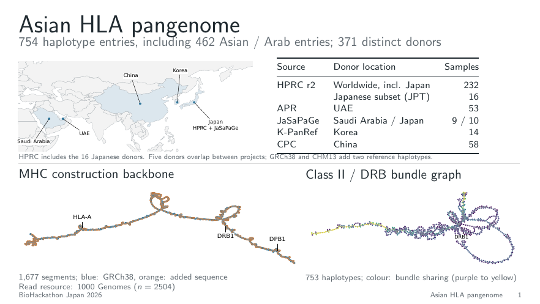
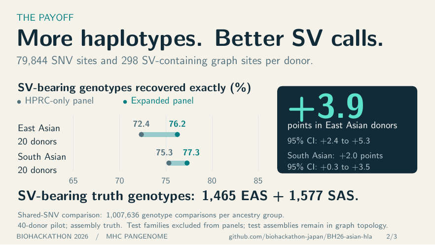

# BioHackathon wrap-up

[Slides (PDF)](slides.pdf) · [PowerPoint for import](slides.pptx) · [Source](slides.tex) · [Speaker notes](speaker-notes.md)

Three slides: graph construction, paired SV/SNV improvement over HPRC, and
Dawn's DogoHLA illustration. White backgrounds and scientific labels keep the
focus on the graphs and comparison. Non-Asian variant recovery is explicitly
marked **Not yet evaluated**.

Build from this directory with `make` (TeX Live and Poppler). The deck includes
all required artwork. Figures are vector PDF/SVG; Dawn's supplied illustration
is the original 1254 × 1254 PNG, without resampling.

The org repository is the publication location:
[slide_prep/hackathon-wrapup](https://github.com/biohackathon-japan/BH26-asian-hla/tree/main/slide_prep/hackathon-wrapup).

## Reproduce the figures

```sh
python3 build_slide_figures.py --graph-data ../../paper/data/graph
make
```

The graph-data argument points to the manuscript's frozen Figure 1 data.
The script exports presentation-sized versions of the map (including HPRC's
Japanese contribution), MHC construction backbone and class II/DRB graph,
plus the paired variant comparison. Outputs are in `figures/paper-panels/`.
Older manuscript panel derivatives remain available there.

`data/variant_paired.tsv` is an unchanged copy of
`hla-asian50/refined/results/variant_paired.tsv` in the analysis repository.
SV: all-truth universe, truth-SV-length class, all endpoint, HPRC baseline.
SNV: frozen-threeway-SNV universe, SNV class, all endpoint, HPRC baseline.
The plot uses the same visual encoding with explicitly different horizontal
scales; confidence intervals resample paired donors.

Construction counts come from `hla-typer/source/haplotype_donors.tsv` and
`hla/results/tables/hprc_r2_populations.tsv` in the analysis repository.
HPRC's 232 donors include 16 JPT donors. Detailed counts and evaluation
limits are in the speaker notes. The DogoHLA PNG is copied unchanged from
[`assets/dogohla-logo.png`](https://github.com/biohackathon-japan/BH26-asian-hla/blob/main/assets/dogohla-logo.png).





The PowerPoint copy contains high-resolution slide images and speaker notes,
for importing into shared presentation tools. Edit scientific text in the
LaTeX source and regenerate; the PowerPoint slide artwork is flattened.
